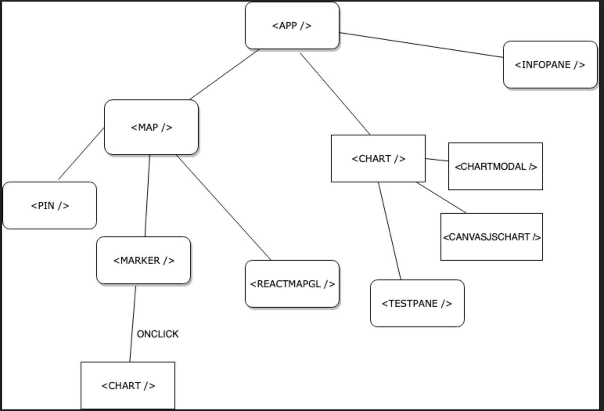

## Watershed Guardians Data

See live demo at: [http://data.thewatershedguardians.org](http://data.thewatershedguardians.org).

The *watershed guardians* is a web application that serves the county of Monterey by helping local residents understand the impacts of climate change on the Carmel river watershed by using maps and graphs.

## Motivation
I was working at the watershed and saw the impact that the river has on the local population. The water,agriculture and tourism industry all depend on the river as a source of water but don't understand the impact that climate change can have on the water source and how it can affect their personal lives. I wanted to build this project to hopefully project a visual understanding of **why this matters**.

## Code style
 [Airbnb/JSX](https://github.com/airbnb/javascript/tree/master/react)
 
## How to use
You can see the map of the Carmel river region, which has markers for each test site.

When you click on a marker for the test site, you can see the data accumulated for that point. We've included 4 test data for each location. Each test data point corresponds to river health in some way.

Feel free to check out the following short video in which I walk through the project:

## Tech/framework used
<b>Built with</b>
- [React](https://reactjs.org/)
- [Mapbox](https://www.mapbox.com/)
- [UberMapboxReactGL](https://github.com/uber/react-map-gl)

## Architecture
Here's the React architecture for the components that shows the parent, child relationship and how user interactions in one component triggers another:

## Installation
run
 
**NPM INSTALL**
**NPM START**

## API Reference
* [MAPBOX](https://www.mapbox.com/)
* [CANVASJS](https://canvasjs.com/)
* [GOOGLE SPREADSHEETS API](https://developers.google.com/sheets/api/)

## Contribute
Thank you for thinking about contributing! Please create a pull request and follow the standard guidlines for contributing to the project. [contribute](https://github.com/zulip/zulip-electron/blob/master/CONTRIBUTING.md)

## Credits
* [Pacific Grove Museum of Natural History](https://www.pgmuseum.org/)- For undertaking this project and doing work that really matters.
* [Calfifornia State University Monterey Bay](https://csumb.edu/)- For encouraging students and researchers to tackle issues at any level.
* [Elkhorn Slough](https://www.elkhornslough.org/) - For their inspirational graphs and website

## License
MIT © [GAUTAM TATA](http://www.gautamtata.com)
